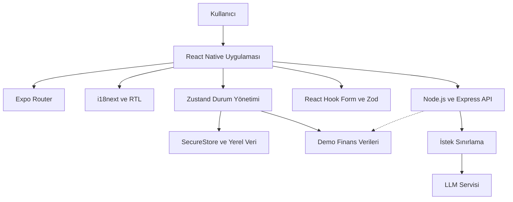
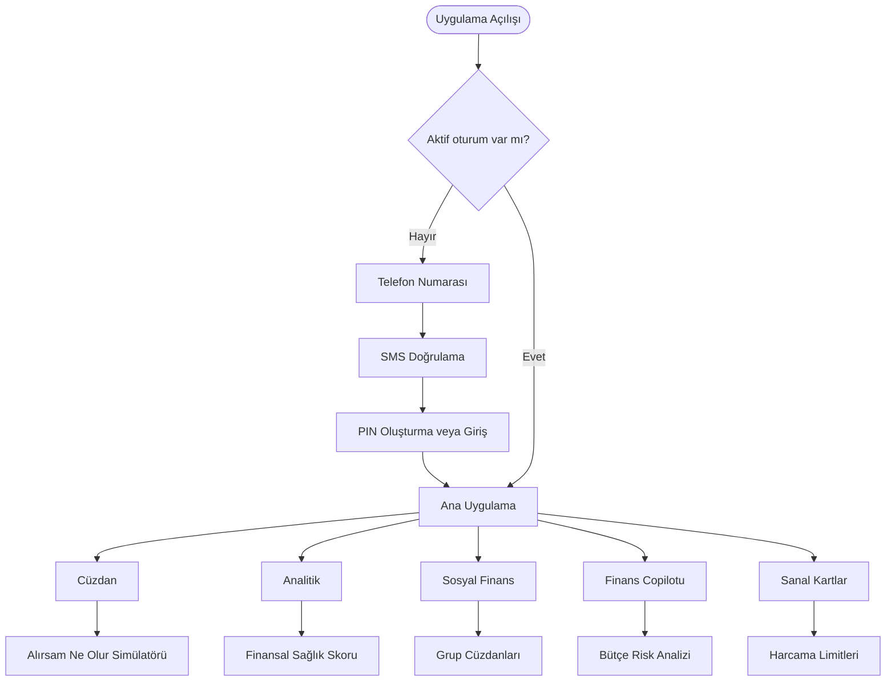
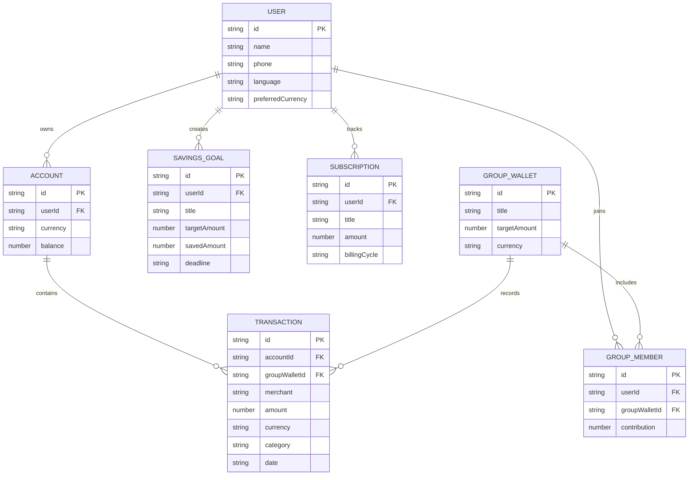

<div align="center">


# NOVA Wallet

**Çok dilli, karar destek odaklı kişisel finans uygulaması**

React Native ve Expo ile geliştirilen NOVA Wallet; bütçe farkındalığı, ortak finans yönetimi ve yapay zekâ destekli finansal içgörüler sunmayı hedefleyen bir mobil uygulama prototipidir.

[](https://expo.dev/)
[](https://reactnative.dev/)
[](https://www.typescriptlang.org/)
[](LICENSE)

[Proje Hakkında](#proje-hakkında) · [Mevcut Durum](#mevcut-durum) · [Mimari](#hedef-mimari) · [Teknolojiler](#teknoloji-yığını) · [Kurulum](#kurulum) · [Yol Haritası](#yol-haritası)

</div>

---

## Proje Hakkında

NOVA Wallet, kullanıcıların yalnızca geçmiş işlemlerini takip etmesini değil, gelecekte verecekleri finansal kararların olası etkilerini de değerlendirmesini amaçlar. Uygulamanın temel yaklaşımı, işlem merkezli bir cüzdan deneyimini karar destek mekanizmalarıyla birleştirmektir.

Proje üç temel problem alanına odaklanır:

| Problem | NOVA Wallet yaklaşımı |
| --- | --- |
| Harcama kararlarının bütçeye etkisinin önceden görülememesi | Planlanan harcamayı gerçekleşmeden önce analiz eden “Alırsam Ne Olur?” simülatörü |
| Ortak masrafların dağınık biçimde yönetilmesi | Katkı ve hedef takibi sunan grup cüzdanları |
| Finansal verilerin bağlamdan yoksun olması | Harcama örüntülerini yorumlayan yapay zekâ destekli içgörüler |

Uygulama Türkçe, İngilizce ve Arapça dillerini hedefler. Arapça arayüz için sağdan sola yerleşim desteği planlanmıştır. Finansal veriler demo verilerinden oluşur; proje gerçek para transferi veya bankacılık işlemi gerçekleştirmez.

> [!IMPORTANT]
> Bu depo bir eğitim ve staj projesidir. Üretim ortamında kullanılabilecek bir bankacılık veya elektronik para ürünü değildir. Gerçek müşteri verisi işlemez ve finansal tavsiye sunmaz.

---

## Mevcut Durum

Depo şu anda temel altyapı aşamasındadır. Aşağıdaki bileşenler doğrudan `main` dalında bulunmaktadır:

| Bileşen | Durum | Açıklama |
| --- | :---: | --- |
| Expo ve React Native kurulumu | Hazır | Expo SDK 57 ve React Native 0.86 yapılandırması |
| Dosya tabanlı yönlendirme | Hazır | Expo Router kök düzeni ve başlangıç ekranı |
| Stil altyapısı | Hazır | NativeWind ve Tailwind CSS yapılandırması |
| Çoklu dil altyapısı | Hazır | Türkçe, İngilizce ve Arapça kaynak dosyaları |
| Tip tanımları | Hazır | Kullanıcı, işlem ve para birimi tipleri |
| Demo finans verileri | Hazır | Kullanıcı ve işlem örnekleri |
| Uygulama ekranları | Geliştirilecek | Kimlik doğrulama, cüzdan, analitik ve sosyal finans ekranları |
| Arka uç servisi | Geliştirilecek | Yapay zekâ istekleri için Node.js ve Express proxy katmanı |

Planlanan özellikler ile tamamlanmış özelliklerin ayrımı, projenin mevcut teknik durumunu doğru yansıtmak amacıyla açık tutulmuştur.

---

## Hedef Mimari

Aşağıdaki diyagram, MVP tamamlandığında ulaşılması planlanan katmanlı yapıyı gösterir.



Kesik bağlantı, arka uç servisi kullanılamadığında demo veri katmanına geçişi ifade eder.

### Hedef Kullanıcı Akışı



### Hedef Veri Modeli



---

## Planlanan MVP Kapsamı

| Alan | Temel işlevler |
| --- | --- |
| Kimlik doğrulama | Telefon numarası, demo SMS kodu, PIN oluşturma ve oturum yönlendirmesi |
| Cüzdan | TRY, USD ve EUR bakiyeleri, bakiye gizleme ve hızlı işlemler |
| Harcama simülasyonu | İşlem sonrası bakiye, bütçe kullanım oranı ve risk düzeyi |
| Sosyal finans | Grup cüzdanları, ortak hedefler ve katkı takibi |
| Analitik | Kategori dağılımı, para akışı takvimi ve finansal sağlık skoru |
| Yapay zekâ | Finans copilotu, bütçe tahmini, anomali tespiti ve otomatik kategorilendirme |
| Sanal kartlar | Kart türleri, kategori limitleri ve kart dondurma işlemleri |
| Yerelleştirme | Türkçe, İngilizce, Arapça ve Arapça için sağdan sola arayüz |

---

## Teknoloji Yığını

Bu tablo depodaki güncel `package.json` dosyasını temel alır.

| Alan | Teknoloji | Sürüm veya görev |
| --- | --- | --- |
| Uygulama çatısı | Expo | SDK 57 |
| Mobil geliştirme | React Native | 0.86 |
| Programlama dili | TypeScript | 6.0 |
| Yönlendirme | Expo Router | Dosya tabanlı navigasyon |
| Stil | NativeWind | Tailwind tabanlı React Native stilleri |
| Durum yönetimi | Zustand | Global uygulama durumu |
| Form yönetimi | React Hook Form | Form durumunun yönetilmesi |
| Doğrulama | Zod | Şema tabanlı veri doğrulaması |
| Yerelleştirme | i18next ve react-i18next | Dil kaynaklarının yönetilmesi |
| Güvenli depolama | expo-secure-store | Hassas yerel veriler |
| Animasyon | React Native Reanimated | Arayüz geçişleri ve etkileşimler |
| Grafikler | react-native-gifted-charts | Finansal veri görselleştirmeleri |
| İkon sistemi | lucide-react-native | Tutarlı arayüz ikonları |

---

## Depo Yapısı

Aşağıdaki yapı yalnızca depoda şu anda bulunan dosya ve klasörleri gösterir.

```text
nova-wallet/
├── app/
│   ├── _layout.tsx
│   └── index.tsx
├── assets/
│   ├── icon.png
│   ├── splash-icon.png
│   └── android-icon-foreground.png
├── src/
│   ├── data/
│   │   └── mockData.ts
│   ├── i18n/
│   │   ├── index.ts
│   │   └── locales/
│   │       ├── ar.json
│   │       ├── en.json
│   │       └── tr.json
│   └── types/
│       ├── global.d.ts
│       └── index.ts
├── app.json
├── global.css
├── implementation_plan.md
├── package.json
├── tailwind.config.js
└── tsconfig.json
```

---

## Kurulum

### Gereksinimler

- Node.js 18 veya üzeri
- npm
- Expo Go, Android emülatörü veya iOS simülatörü

### Projeyi Çalıştırma

```bash
git clone https://github.com/isambais/nova-wallet.git
cd nova-wallet
npm install
npm start
```

Platforma özel çalıştırma komutları:

```bash
npm run android
npm run ios
npm run web
```

---

## Yol Haritası

| Aşama | Çıktı |
| --- | --- |
| 1. Temel altyapı | Expo, TypeScript, NativeWind, yönlendirme ve çoklu dil altyapısı |
| 2. Kimlik doğrulama | Dil seçimi, telefon, SMS doğrulaması ve PIN ekranları |
| 3. Cüzdan deneyimi | Ana ekran, bakiyeler, işlemler ve harcama simülatörü |
| 4. Sosyal finans ve analitik | Grup cüzdanları, hedefler, abonelikler ve finansal grafikler |
| 5. Yapay zekâ katmanı | Copilot, tahmin, anomali tespiti ve arka uç proxy servisi |
| 6. Kalite ve teslim | Testler, ekran görüntüleri, dokümantasyon ve son kontroller |

Ayrıntılı teknik plan için [`implementation_plan.md`](implementation_plan.md) dosyasını inceleyin.

---

## Güvenlik ve Kapsam Sınırları

NOVA Wallet bir demo prototipidir. Mevcut kapsam aşağıdaki yetenekleri içermez:

- Gerçek para transferi
- Banka hesabı veya ödeme hesabı oluşturma
- Gerçek kart çıkarma
- Gerçek SMS veya KYC doğrulaması
- Ödeme ağı ve banka entegrasyonu
- PCI-DSS, MASAK veya TCMB uyumluluk süreçleri

Üretim ortamına geçiş; yetkili bir banka veya elektronik para kuruluşuyla entegrasyon, kapsamlı güvenlik testleri ve ilgili yasal gerekliliklerin yerine getirilmesini gerektirir.

---

## Geliştirici

**Isam**  
Yapay Zekâ Mühendisliği — Mobil Uygulama Geliştirme — Finansal Teknolojiler

GitHub: [@isambais](https://github.com/isambais)

---

## Lisans

Bu proje [MIT Lisansı](LICENSE) kapsamında yayımlanmıştır.
